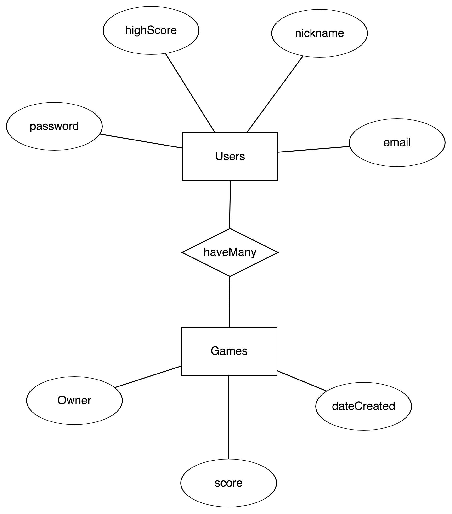

# [Coin.io](https://github.com/KingNaranja/Coin-Minigame/)

# [Coin.io Api Server](https://github.com/KingNaranja/Minigame-Api)

### Minigame repositories:
https://github.com/KingNaranja/Coin-Minigame 

https://github.com/KingNaranja/Minigame-Api

### Links to deployed sites: 
Minigame Client: https://kingnaranja.github.io/Coin-Minigame/

Minigame API: https://aqueous-oasis-20309.herokuapp.com/

# What is it ?
A single page web application that allows users to sign-up, play a simple arcade game and try to compete against the high scores of other users.

The minigame API allows users to GET past games as well as CREATE new ones. Moreover, users can make requests to the `/leaderboard` route to view where they rank.

# How it works
The minigame API schema contains 2 resource models, `users` and `games`. An authorized user is able to CRUD games as well as update the player nickname however requests to the leaderboard does not require any authorization.

The `/leaderboard` route sends a GET request for every user and sorts the response by the user's high score. This action allows the user to see where the they 'rank' out of all the users.

# Technologies Used:
### Client
 * HTML / CSS
 * JavaScript
 * jQuery
 * Ajax
 * Handlebars.js
 * SASS
 * Bootstrap
 * *Phaser 3*

### API
* JavaScript
* Express
* MongoDB
* Mongoose
* Node.js

# Documentation

### Authentication

| Request type | Route              | Action                  | Return if Successful         |
| ------------ | ------------------ | ----------------------- | ---------------------------- |
| POST         | `/sign-up`         | Creates a new user      | 201 / user object            |
| POST         | `/sign-in`         | Checks credentials      | 201 / user object with token |
| PATCH        | `/change-password` | Hashes new password     | 204                          |
| DELETE       | `/sign-out`        | Hashes stored Api Token | 204                          |

### User Actions

| Request type | Route            | Action                                                       | Return if Successful |
| ------------ | ---------------- | ------------------------------------------------------------ | -------------------- |
| INDEX        | `/games`         | Fetches all games, sorts by date created (newest first)      | 200 / all games      |
| SHOW         | `/games/:id`     | Fetches single game                                          | 200 / one game       |
| CREATE       | `/games`         | Creates a new game                                           | 201 / created game   |
| PATCH        | `/games/:id`     | Updates contents of a game (if owned by requesting user)     | 204                  |
| DELETE       | `/games/:id`     | Deletes a game (if owned by requesting user)                 | 204                  |
| INDEX        | `/games/myGames` | Fetches / sorts all games, then filters for those owned by the requester | 200 / all my games   |
| PATCH        | `/users/:id`     | Updates User nickname and high score                         | 200                  |
| PATCH        | `/leaderboard`   | Fetches 5 users; sorted by their high score (highest first)  | 200                  |

# Planning

I planned early on to use Express and Mongoose to serve my backend because I understood that it would be easier to create an unrelationable database. The game scene was scoped to be as simple as possible in order for me to easily make requests to this API from inside the game scene.

[User Stories](https://imgur.com/dAujhg4)

# Future
While the client side has the scalability to add more game scenes, the `games` model will have to be refactored to work better with while the number of users in the database grow.
- Logic needs to be implemented to calculate the total Score / high score so the client   does not make to many request during an instance. 
